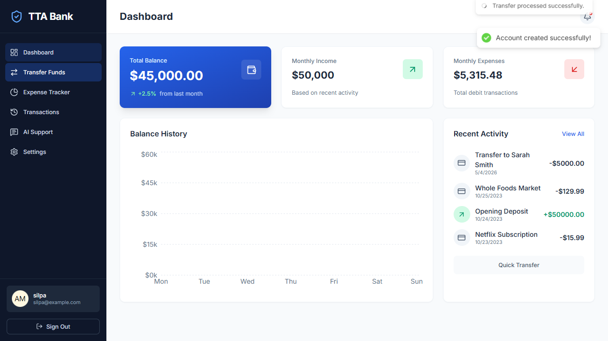

# Playwright TypeScript Framework

This project provides a clean Playwright end-to-end testing framework using TypeScript and a lightweight page-object pattern.

## Prerequisites

- Node.js 18+ (Playwright supports the latest LTS releases).

## Install

```bash
npm install
```

This installs Playwright, TypeScript, and the browser binaries needed to run the tests.

## Run Tests

- Run the full suite: `npx playwright test`
- Run a single spec: `npx playwright test tests/specs/invalid-gmail.spec.ts`
- Open the UI mode: `npx playwright test --ui`
- Debug a test: `npx playwright test tests/specs/invalid-gmail.spec.ts --debug`
- View the last HTML report: `npx playwright show-report`

## Project Layout

- `tests/specs/` - TypeScript test specs written with Playwright Test.
- `tests/pages/` - Page Object Model helpers that wrap page interactions.
- `tests/fixtures/` - Custom fixtures that compose reusable test context.
- `playwright.config.ts` - Central configuration for browsers, timeouts, and reporters.
- `tsconfig.json` - TypeScript compiler settings used by Playwright.

You can extend the framework by adding more fixtures for data setup, additional page objects, or custom reporters in `playwright.config.ts`.

## Custom TTA Reporter

The framework ships with `utils/CustomTTAReports.ts`, a rich HTML reporter that streams real-time execution status, historical runs, and embeds artifacts (screenshots, logs, trace, and video links). It is already wired into `playwright.config.ts`, so every `npx playwright test ...` command will emit the customised dashboard.

### Where to find the output

- `tta-report/index.html` always redirects to the most recent run.
- `tta-report/report_YYYYMMDD_HHMMSS.html` stores each individual execution for history.
- `tta-report/history.html` lists all previous runs with quick links.
- `tta-report/screenshots/` keeps the step-level screenshots that the report references.

Open the latest report via:

```bash
npx playwright test
start "" tta-report\\index.html   # Windows
```

Or double-click `tta-report/index.html` in your file explorer.

### Sample dashboard

Below is an example of the generated dashboard after running `tests/specs/invalid-gmail.spec.ts`:



Feel free to customise the reporter (styles, sections, filters, etc.) by editing `utils/CustomTTAReports.ts`. The reporter runs entirely offline, so you can check the report into source control or publish it as part of a CI artifact.
